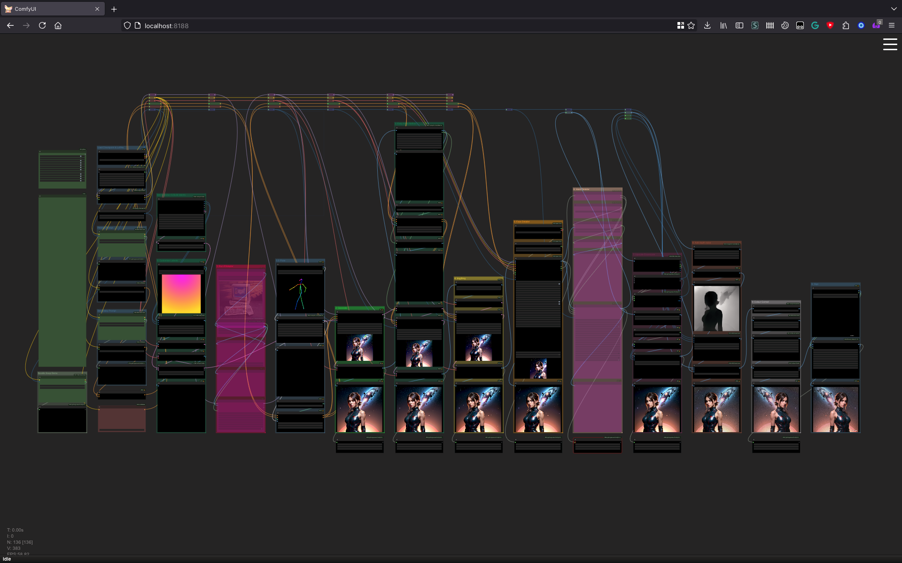

# My Stable Diffusion Workflow for ComfyUI

[This JSON file](workflow1.json) is a snapshot of my multi-pass workflow for ComfyUI.

[ComfyUI](https://github.com/comfyanonymous/ComfyUI/)'s node graph-based system is powerful but it can quickly descend into _noodle chaos_. I've tried to battle that in this workflow. Each column in the workflow is a stack with a particular focus: conditioning, generation, upscaling, fixing faces, hands, colour correction and so on. They are fed by a bus of common values which runs across the top of the graph. (Yes, some plugins offer pipes to improve this but they're not available _everywhere_...)

Example output. This PNG also includes the workflow.

## Dependencies

Lots and lots.

